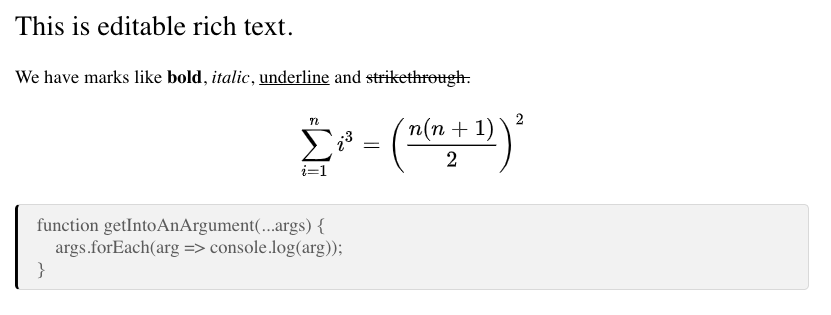

LIVE DEMO: [mio-editor](https://asnunes.github.io/mio-editor)

# mio-editor

[](https://badge.fury.io/js/mio-editor)

A Slate JS 0.5+ and React based WYSIWYG editor. It's a ready-to-use react component that provides an interface to edit documents and get them as a JSON.

### Implemented Features: 

- Resizable Images
- Math equation
- Code
- Title
- Paragraph:
  - Bold
  - Italic
  - Underline
  - Strikethrough

### Why another WYSIWYG editor?

1. It has support for **math equation** using [asciimath](http://asciimath.org/) syntax.
2. Many editors available only offer a way to edit DOM, but it is difficult to get back edited content. Mio editor can **load and update content as a simple JSON**.
3. It uses react from [slate](https://docs.slatejs.org/) framework to handle DOM. So **you can use it individually or as a react component**.

### Usage

Just import MioEditor. Editor's value is handled by ```value``` and ```onValueChange``` props.

```javascript
import MioEditor from 'mio-editor';

const App = () => {
  const [value, setValue] = useState(null);

  const onValueChange = value => {
    setValue(value);
    // ...
  };

  return (
    <MioEditor
      value={value}
      onValueChange={onValueChange}
    />
  );
};
```

In this example, it will render an empty page ready to be edited. Everytime an edition occur, ```onValueChange``` will be called with a JSON representing new content. The content JSON looks like:

````json

  {
     "type":"header",
     "children":[
        {
           "text":"This is an editable rich text."
        }
     ]
  },
  {
     "type":"paragraph",
     "children":[
        {
           "text":"We have marks like "
        },
        {
           "text":"bold",
           "bold":true
        },
        {
           "text":", "
        },
        {
           "text":"italic",
           "italic":true
        },
        {
           "text":", "
        },
        {
           "text":"underline",
           "underline":true
        },
        {
           "text":" and "
        },
        {
           "text":"strikethrough.",
           "strikethrough":true
        }
     ]
  },
  {
     "type":"math",
     "children":[
        {
           "text":"sum_(i=1)^n i^3=((n(n+1))/2)^2"
        }
     ]
  },
  {
     "type":"code",
     "children":[
        {
           "text":"function getIntoAnArgument(...args) {\n    args.forEach(arg => console.log(arg));\n}"
        }
     ]
  },
];
````

Which represents the following visual content:




It is possible to pass an initial value to editor. Just pass it to ```useState```, where initialValue is a JSON like the one above. You can get more examples looking in the examples folder.

```javascript
const App = () => {
  const [value, setValue] = useState(initialValue);
  //...
}
```

### Dependencies

React 16.X.X

### Installation

```
npm install mio-editor --save
```
